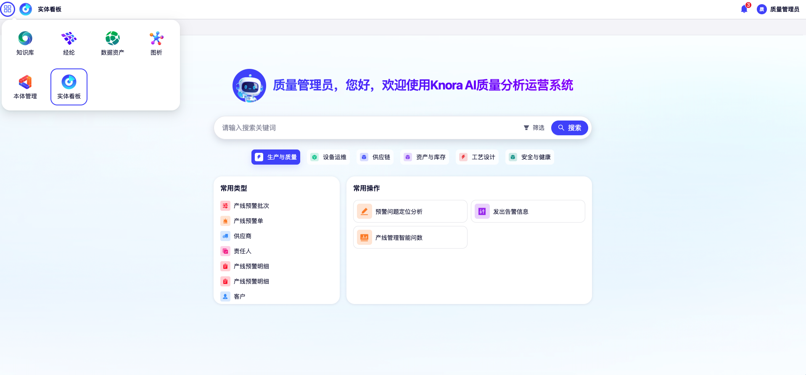

欢迎使用{{aio.name}}
===

## 平台介绍

{{aio.name}}是悦点科技推出的以本体（Ontology）为核心的企业级 Agentic AI 平台，面向复杂业务环境下的数据割裂、语义不一致与智能难以规模化落地等问题，提供统一、可控、可演进的智能底座。

企业在数字化进程中普遍面临三重困境：

- **语义分裂**：同一业务实体在不同系统中定义不一、口径矛盾，概念漂移导致数据孤岛。
- **知识离散**：非结构化知识碎片化沉淀，缺乏概念框架支撑检索与复用。
- **规则冗余**：业务逻辑分散重复维护，跨系统协同成本高企。

{{aio.name}}通过构建企业级业务本体，对核心对象、业务规则、指标口径与流程关系进行系统化建模，形成稳定的语义层，用于支撑跨系统数据整合与一致性理解。在本体约束下，平台将大模型能力与智能体执行机制进行工程化融合，使模型推理始终基于明确的业务语义与规则边界运行，有效降低口径偏差与"幻觉"风险。

{ width="100%", loading=lazy }
/// caption
Knora 4.0 平台主界面
///

## 核心能力概览

| 能力模块 | 核心价值 |
|------|------|
| **本体管理** | 可视化构建企业知识图谱，统一实体、关系、事件与行为的语义定义 |
| **流程活动（Workflow）** | 低代码编排智能体工作流，将大模型、知识库、工具与业务逻辑统一纳入流程 |
| **自主推理（Knora Claw）** | Agentic 自主规划引擎，支持多智能体协同处理复杂业务目标 |
| **知识库** | 企业级文档与数据知识管理，支持 RAG / GraphRAG 多路检索增强 |
| **数据资产** | 统一数据资产盘点与目录管理，提升数据可发现性与治理效率 |
| **经纶（Pipeline）** | 结构化数据治理引擎，覆盖接入、清洗、标准化与知识化全流程 |

## 界面导航总览

登录 {{aio.name}} 平台后，页面整体分为以下几个区域：

**顶部区域（系统导航）**

- 提供系统各模块的入口
- 支持在不同功能模块之间进行切换
- 展示用户信息及系统通知状态

**用户信息区域**

- 显示当前登录用户及系统欢迎信息
- 用于确认当前操作身份

**搜索与分类区域**

- **搜索框（实体看板）**
    - 用于输入关键词进行内容检索
    - 支持快速定位系统中的相关数据或功能

- **业务分类切换**
    - 按业务域划分系统内容
    - 切换后，下方内容会随分类变化

**功能入口区域**

用于提供常用内容与操作的快捷访问，分为两类：

- **常用类型**
    - 展示系统中的核心业务对象
    - 点击后进入对应内容列表或详情页面

- **常用操作**
    - 展示常见业务操作入口
    - 点击后进入对应功能页面或操作流程