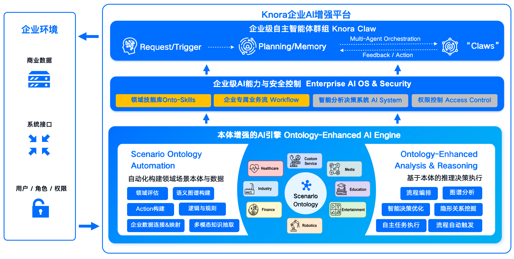

主要功能概述
====

{{aio.name}}平台完整功能架构如下图所示：

{ width="100%", loading=lazy }
/// caption
{{aio.name}}平台功能架构图
///

用户使用平台构建并管理AI应用时，主要使用的功能包括：

- **本体管理**：可视化构建企业知识图谱，统一管理实体、关系、事件与行为定义
- **流程活动**：低代码编排智能体工作流，支持可视化拖拽与多类型节点配置
- **自主推理（Knora Claw）**：Agentic 自主规划引擎，自动拆解复杂任务
- **知识库管理**：文档知识库与数据知识库，支持 RAG 多路检索增强
- **工具与模型**：自定义工具、内置工具、智能体工具、MCP 工具统一管理
- **用户界面（App）**：面向业务用户的实体看板与操作入口配置
- **图析**：知识图谱可视化关系分析能力
- **数据资产**：统一数据资产盘点与目录管理
- **经纶**：结构化数据治理引擎
- **密钥管理**：API 接口鉴权密钥管理
