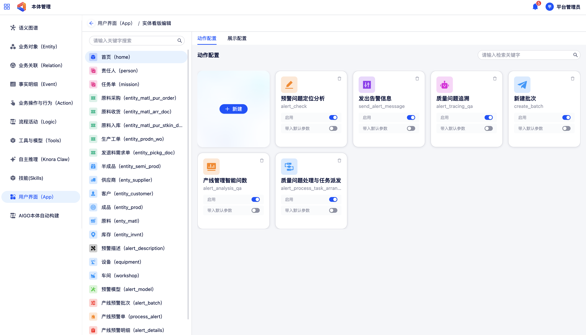
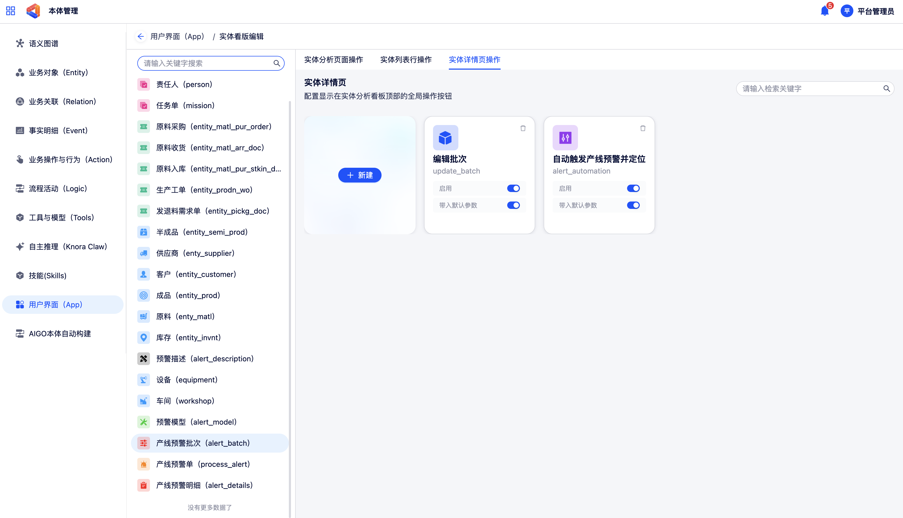
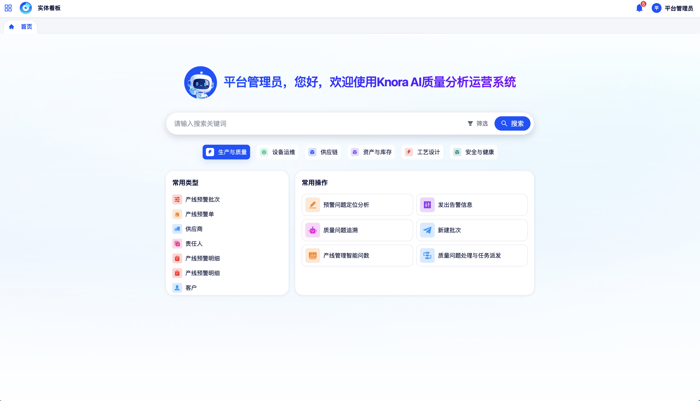
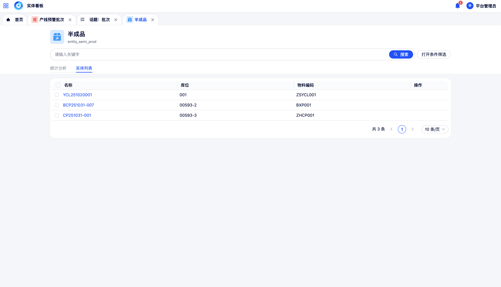
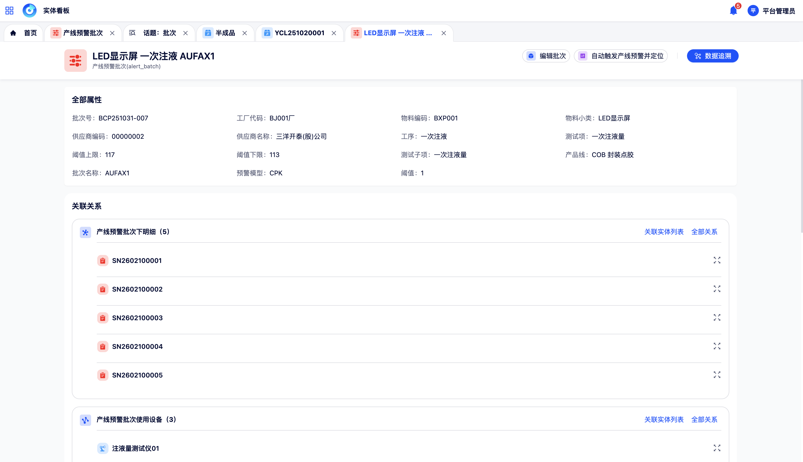

# 用户界面（App）与实体看板

用户界面（App）与实体看板是面向**业务用户**的核心操作入口。管理员在「用户界面（App）」配置模块中完成实体看板的展示与操作配置，业务用户则在「实体看板」中基于配置好的界面进行日常的实体数据查询、详情查看与业务操作。

## 用户界面（App）配置

用户界面（App）配置模块面向**管理员**，用于定制每种实体类型在实体看板中的展示样式与可执行操作。

在左侧导航中点击**用户界面（App）**，进入配置页面。

### 1 实体类型切换

页面左侧展示平台已定义的全部实体类型列表，点击不同实体类型，右侧配置区域随之切换为该实体类型的独立配置视图。

每个实体类型的看板配置相互独立，可根据不同业务对象的差异化展示需求分别进行设置。

### 2 首页展示配置

在选定实体类型的配置页面，可配置该实体看板首页搜索框上方区域的展示内容：

{ width="100%", loading=lazy }
/// caption
图6-1 首页展示配置
///

- **图标**：选择在搜索框上方展示的业务图标。
- **标题文案**：设置图标旁边的标题文字，如"客户档案查询"、"合同管理"等。

### 3 实体操作配置

实体操作配置用于将已在「本体管理 → 业务操作与行为（Action）」中定义的 Action 挂载至实体看板的操作入口。

{ width="100%", loading=lazy }
/// caption
图6-2 实体操作配置
///

每个 Action 可配置显示在以下三个位置之一：

- **实体分析页面**：在实体看板的分析视图中展示操作按钮。
- **实体列表行**：在实体列表每行数据的操作列中展示。
- **实体详情页**：在实体详情页中展示操作按钮。

对每个已挂载的 Action，还可进行以下配置：

- **启用 / 禁用**：控制该 Action 是否对业务用户可见。
- **默认参数带入**：为 Action 的部分参数配置默认值，执行时自动带入当前实体的相关字段值。

## 实体看板（业务用户视角）

实体看板是业务用户进行实体数据查询与业务操作的主界面。

在左侧导航中点击**实体看板**，进入看板首页。

### 1 实体检索

{ width="100%", loading=lazy }
/// caption
图6-3 实体看板检索界面
///

- **关键词搜索**：对实体数据进行模糊匹配检索，支持数据检索和元数据检索两种模式。
- **多条件筛选**：展开筛选面板，按实体属性值设置过滤条件。

### 2 实体列表

{ width="100%", loading=lazy }
/// caption
图6-4 实体列表界面
///

- **列字段渲染**：列表的列字段根据实体的属性定义自动渲染。
- **列表内检索**：在列表顶部搜索框中继续输入关键词进行过滤。
- **行内操作**：在每行数据右侧的操作列中，可直接触发该实体已挂载的 Action。

### 3 实体详情

{ width="100%", loading=lazy }
/// caption
图6-5 实体详情页
///

详情页集中呈现单条实体记录的完整信息：

- **全部属性字段内容**
- **关联关系**：展示该实体在知识图谱中与其他实体之间的关联关系列表
- **详情页操作按钮**

### 4 Logic 执行

在实体看板中，可触发与该实体关联的**智能体工作流（Logic）**：

系统将当前实体的本体数据作为上下文输入传递给 Workflow，驱动智能体完成分析、推理或数据处理等任务。

### 5 Action 执行

在实体看板中点击任意已挂载的 **Action** 操作按钮：

1. 系统弹出该 Action 的参数表单（配置为"用户输入"的参数需手动填写）
2. 用户检查并填写参数后，点击**确认执行**
3. 系统按照 Action 定义的规则步骤依次执行，对图谱数据进行实时写入与更新
