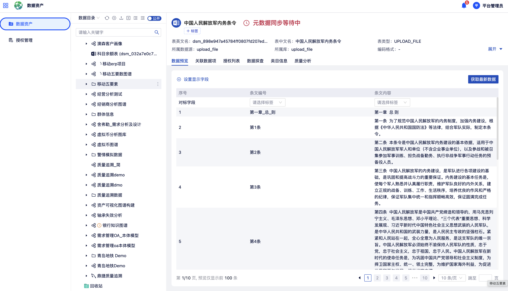

# 数据资产

数据资产模块提供企业数据的统一盘点与目录管理能力，将平台已接入的各类数据源以可视化方式呈现为资产目录，并通过授权管理机制控制不同用户对数据资产的访问权限。

在左侧导航中点击**数据资产**，进入数据资产管理页。

## 1 数据目录

### 资产目录

数据目录以**目录树**的形式展示租户下已对接的所有数据资产。

{ width="100%", loading=lazy }
/// caption
图9-1 数据资产目录树
///

通过目录树可直观了解当前平台已接入的数据资产全貌，点击节点可展开下级目录，直至具体的数据表层级。

### 数据源连接

平台支持接入以下多种类型的数据源：

**关系型数据库**：MySQL、Oracle、GaussDB、PostgreSQL 等

**非关系型数据库**：HBase、Elasticsearch、MongoDB 等

**图数据库**：NEST

通过**新建数据源**操作，配置对应数据源的连接信息（主机地址、端口、数据库名、用户名、密码等）。

同时支持上传本地的 **Excel / CSV** 离线文件作为数据资产。

## 2 授权管理

授权管理用于控制平台用户对数据资产的访问权限。

在**授权管理**子模块中，支持从以下两个维度查看与管理授权信息：

- **资产维度**：以数据资产（数据表）为视角，查看某张数据表当前已授权给哪些用户
- **用户维度**：以用户为视角，查看某个用户当前持有哪些数据资产的访问权限

均支持对已有授权进行**批量取消授权**操作。
