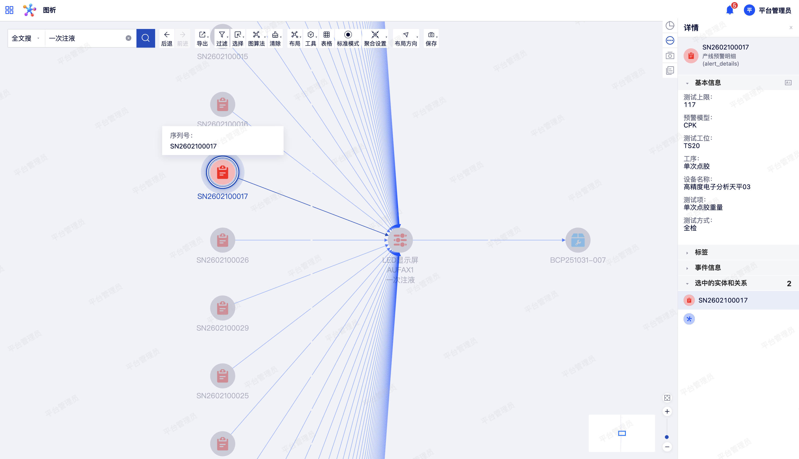

# 图析

图析模块提供面向知识图谱的可视化关系分析能力，支持用户在画布上对实体进行交互式扩展、关系推演、过滤标注与图算法分析，适用于关联结构探索、风险路径识别、关键节点发现等复杂业务研判场景。

在左侧导航中点击**图析**，进入图析画布界面。

{ width="100%", loading=lazy }
/// caption
图7-1 图析主界面
///

## 1 实体搜索

画布左上角提供全局检索框，用于在图谱数据中定位目标实体。

在检索框中输入关键字，支持对实体数据进行**模糊检索**或**精确检索**，检索范围包括：

- **大图**：基于批量治理的全量图谱数据进行检索。
- **小图**：仅在当前登录用户的个人图或主题图范围内进行检索。

## 2 实体扩展

选中画布中的一个或多个实体节点后，可通过实体扩展操作拓展其关联实体。

支持以下四种扩展方式：

**全部扩展**：展开被选中实体的所有 1 度关系实体。

**条件扩展**：选中实体后，系统展示全部关联关系类型，可按以下条件过滤：

- **关系类型**：选择扩展的关系类型。
- **关系方向**：选择向外扩展或向内扩展。
- **扩展层级**：设置扩展的跳数。
- **时间范围**：按关系的时间属性限定扩展范围。

**实体收回**：选中一个或多个实体，将其对端仅存 1 度关系的实体从画布中收回。

**默认双击扩展配置**：在图析设置中，可配置双击实体时的默认扩展行为。

## 3 关系推演

关系推演用于主动计算并展示实体之间的关系路径。

支持以下四种推演方式：

| 推演方式 | 说明 |
|------|------|
| **直接推演** | 选中实体，推演并展示 **2 跳以内**的全路径网络关系 |
| **条件推演** | 按指定关联关系类型进行推演，最多支持 **4 跳** |
| **全图最短路径** | 从全库数据中计算两实体之间的最短关系路径 |
| **画布最短路径** | 仅基于当前画布已加载内容计算最短路径 |

## 4 实体 / 关系过滤

点击画布工具栏中的**过滤**按钮，展开过滤配置面板，支持按以下维度设置过滤条件：

- **实体 / 关系类型**：选择需要高亮显示的实体或关系类型。

满足过滤条件的实体或关系在画布中**高亮显示**，不满足条件的节点变暗。

已配置的过滤条件支持**保存为筛选器**，方便下次直接调用。

## 5 研判集合与新画布

**添加至研判集合**

选中一个或多个实体，点击**添加至研判集合**，可将这些实体归入一个命名的研判分组。

研判集合支持**新增一级分类**和**二级分类**，用于对不同主题的研判对象进行层级化组织。

**在新画布中打开**

选中画布中的一个或多个实体，点击**在新画布中打开**，系统将在一个新的空白画布中重新加载所选实体。

## 6 标签管理

标签用于对画布中的实体进行文字标注，辅助记录分析结论或标记关注原因。

选中画布中的一个实体，点击**添加标签**，在弹窗中输入不超过 **10 个字**的标签描述。

标签分为以下三种类型：

- **我的标签**（个人标签）：仅当前用户可见。
- **共享标签**：可将个人标签分享给其他用户查看。
- **系统标签**：由系统或管理员统一配置的标签，供所有用户查看。

## 7 图算法

点击画布工具栏中的**图算法**按钮，选择需要执行的算法类型：

| 算法 | 说明 |
|------|------|
| 中介性（Betweenness Centrality） | 衡量节点在图中作为"桥梁"的程度 |
| 紧密性（Closeness Centrality） | 衡量节点到图中其他节点的平均距离 |
| 聚集系数（Clustering Coefficient） | 衡量节点周围邻居之间的紧密程度 |
| 度中心性（Degree Centrality） | 衡量节点直接连接的关系数量 |

算法执行后，画布中的节点将根据计算结果调整视觉呈现（如大小或颜色深浅）。

点击**取消执行**，可恢复画布至算法执行前的初始状态。

## 8 画布布局

在画布工具栏中点击**布局**，可对当前画布中全部实体与关系的可视化排列方式进行调整。

| 布局方式 | 适用场景 |
|------|------|
| **自动布局** | 系统自动计算最优布局 |
| **网格布局** | 将节点均匀排列在网格中 |
| **层次布局** | 按层级关系纵向排列 |
| **环形布局** | 将节点排列在圆环上，突出中心节点与周围节点的关系 |

同时支持对布局**方向**进行设置（如从左到右、从上到下等）。
