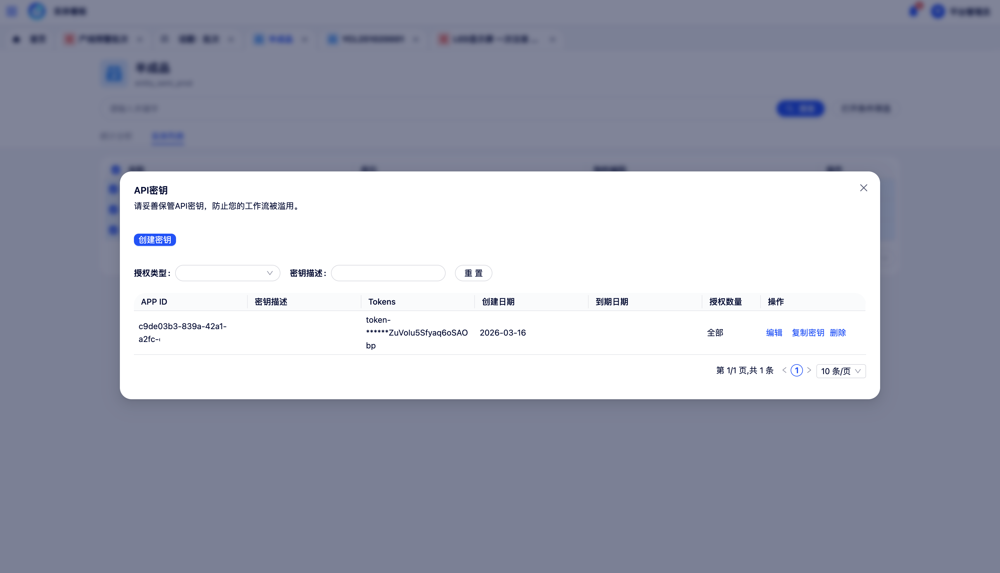

# 密钥管理

密钥管理模块用于创建和管理平台 API 调用的鉴权密钥，保障智能体、知识库等对外接口服务的数据安全。

在页面右上角点击**用户头像**，选择**密钥设置**，进入密钥管理页面。

{ width="100%", loading=lazy }
/// caption
图11-1 密钥管理
///

## 1 创建密钥

点击**创建密钥**按钮，系统生成一个新的密钥条目。新密钥默认对平台全部 API 资源有效，可在创建后通过编辑操作调整授权范围。

## 2 编辑密钥

点击密钥列表中某条密钥的**编辑**按钮，可配置以下信息：

**授权范围**

- **全部资源**：该密钥可调用平台内所有智能体、知识库及 Bot 的 API 接口
- **指定资源**：取消全部授权选项后，可单独选择该密钥允许调用的特定 Workflow、知识库或多智能体 Bot

**到期日期**：设置密钥的有效期限，到期后自动失效。不设置有效期则密钥长期有效。

## 3 密钥列表管理

密钥列表展示当前用户已创建的全部密钥，每条记录包含授权类型、授权范围及到期日期等信息，并支持按关键词进行检索。
