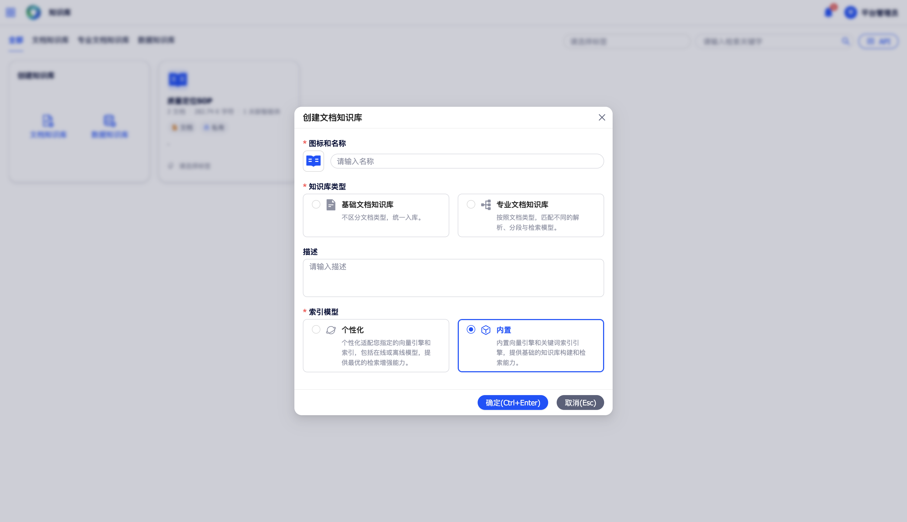
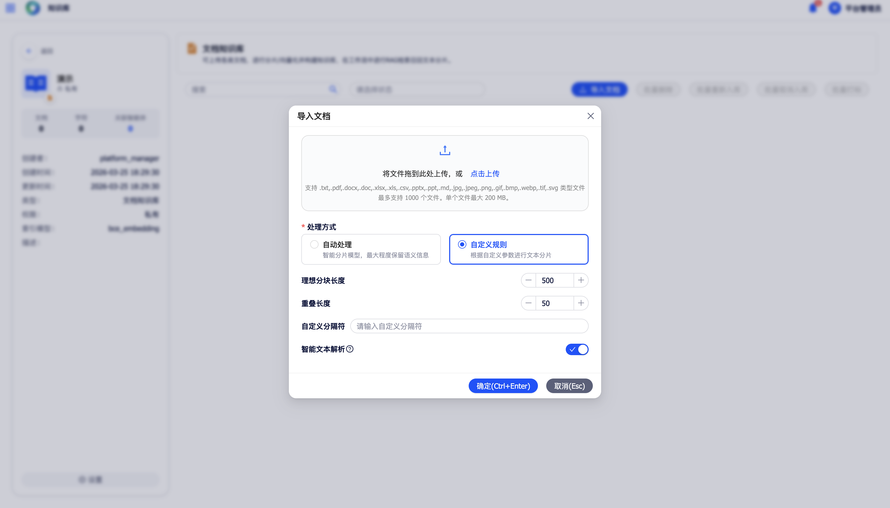
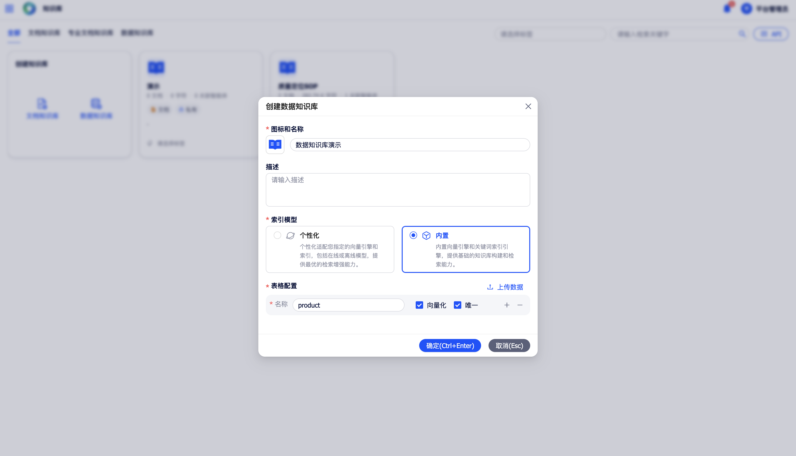

# 知识库

知识库模块为平台智能体提供私域知识存储与检索能力，支持文档与结构化数据两种知识形态，通过 RAG（检索增强生成）机制让大模型在推理时能够准确引用企业内部知识。

在左侧导航中点击**知识库**，进入知识库列表页。

## 文档知识库

文档知识库用于管理企业内部的非结构化文档资产，平台自动完成文档的分片与向量化处理。文档知识库分为**基础文档知识库**和**专业文档知识库**两种类型。

### 1 创建文档知识库

在知识库列表页点击**创建文档知识库**，在弹窗中填写以下信息：

{ width="100%", loading=lazy }
/// caption
图8-1 创建文档知识库
///

- **知识库类型**：选择**基础文档**或**专业文档**
- **知识库名称**（必填）
- **知识库图标**（选填）
- **知识库描述**（选填）
- **索引模型**：选择用于文档向量化的嵌入模型

**专业文档知识库**额外支持三类文档的智能识别与语义分片：**简历**、**法条**、**其他文档**。

### 2 文档数据导入

{ width="100%", loading=lazy }
/// caption
图8-2 文档数据导入
///

- **批量上传**：选择本地文件批量上传，平台自动完成文档读取、分片与向量化嵌入。
- **支持格式**：docx、doc、txt、pdf、xls、xlsx、csv、ppt、pptx、md 等。
- **分片参数配置**：上传时可自定义文档的分片策略。

### 3 智能文档解析

- **OCR**：识别扫描件与图片中的文字内容
- **图表解析**：识别文档中的表格与图表数据
- **文档版面还原**：还原文档的多栏布局、段落结构
- **图文引用输出**：将图片与表格中提取的信息构建为可供检索的知识内容

### 4 文档管理

- **列表查看**：展示所有文档的名称、上传时间、分片数量、向量化状态等
- **关键词检索**：按文档名称过滤列表
- **启用 / 禁用**：控制该文档是否参与知识库检索
- **重试**：对于处理状态异常的文档，可手动触发重新处理

### 5 基础文档分片管理

- **查看分片内容**：逐条查看该文档被切分后的每段文本内容
- **新增 / 编辑 / 删除分片**：对分片内容进行精细化维护
- **启用 / 禁用分片**：控制单条分片是否参与检索

### 6 专业文档分片管理

专业文档知识库的分片结构以**文档目录层级**进行组织：

- **目录结构浏览**：以树状结构展示文档的章节目录
- **全文检索**：对当前文档全部分片内容进行检索
- **节点编辑 / 内容编辑**：对目录节点和分片内容进行修改

### 7 文档标签管理

在文档列表中，选中一篇或多篇文档，点击**标签管理**，可为文档添加、编辑或删除标签。

## 数据知识库

数据知识库用于管理结构化的表格数据，通过对指定字段进行向量化处理，支持基于语义相似度的数据检索。

### 1 创建数据知识库

{ width="100%", loading=lazy }
/// caption
图8-3 创建数据知识库
///

- **知识库名称**（必填）
- **知识库图标**（选填）
- **可见范围**：设置知识库对其他用户的可见级别
- **索引模型**：选择向量化嵌入模型
- **唯一标识字段**：指定数据表中作为记录唯一标识的字段

### 2 数据导入与维护

- **页面手动录入**：在数据表界面直接新增一行数据
- **批量导入**：上传 Excel 或 CSV 文件批量写入
- **API 接入**：通过知识库 API 接口以程序化方式持续写入
- **编辑 / 删除**：对数据行进行维护
- **导入 / 导出**：支持以文件形式备份或恢复数据

### 3 数据检索测试

在检索测试输入框中输入查询内容，系统返回按**匹配度由高到低排序**的数据记录列表，并展示相似度分值。

## 知识库通用管理

### 知识库列表查看

知识库列表以**卡片形式**展示当前用户可见的全部知识库。

### 知识库分享

在知识库详情页或列表页的操作菜单中，点击**分享**，将该知识库分享给指定的用户或用户组。

### 知识库检索与标签筛选

- **关键字检索**：按知识库名称进行过滤
- **打标签 / 标签筛选**：对知识库进行分类管理

### 知识库基本信息维护

点击**编辑**，可对知识库名称、图标、描述及可见范围进行修改。

## 知识库 API

平台对外提供知识库的完整 API 接口服务：

| API 类型 | 说明 |
|------|------|
| **知识库管理** | 创建、查询、修改、删除知识库 |
| **数据接入** | 批量写入文档或结构化数据至知识库 |
| **数据操作** | 对知识库内的数据进行更新、删除等维护操作 |
| **数据检索** | 通过 API 对知识库执行检索查询 |

在知识库详情页，点击**API 文档**，可查看该知识库的完整接口说明。API 调用需使用平台密钥进行鉴权（详见 **密钥管理**）。
