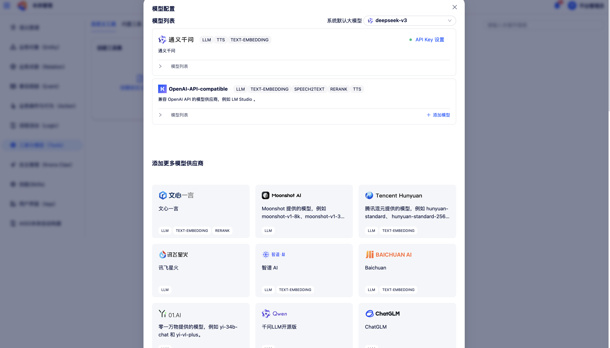

# 模型配置

模型配置模块用于管理平台可调用的大语言模型资源，支持接入主流线上模型与本地私有化部署模型。

在左侧导航中点击**模型配置**，进入模型管理页。

## 1 新增预定义模型

预定义模型指平台已适配的主流大模型供应商（如 DeepSeek、OpenAI、通义千问、文心一言、智谱 AI 等）提供的模型。

在供应商列表中找到目标供应商，点击**设置**或**添加模型**：

{ width="100%", loading=lazy }
/// caption
图5-3 新增预定义模型
///

- 对于**线上模型**：在弹窗中输入该供应商的 API Key，点击保存即完成添加。
- 对于**本地部署模型**：填写模型类型、部署 URL 地址及其他必要的基础信息。

完成添加后，可用模型将展示在上方的模型列表中，并通过模型标签标识该供应商支持的模型类型（LLM 模型、VL 视觉模型、Embedding 嵌入模型、TTS 语音模型等）。

## 2 新增自定义模型

对于未在预定义列表中的模型，可通过自定义方式接入：

- **模型协议**：选择模型的接口协议类型（OpenAI 协议 / Hugging Face 协议等）。
- **模型名称**：填写模型的标识名称。
- **部署 URL**：填写模型 API 的访问地址。
- **API Key**（如需）：填写鉴权密钥。

## 3 模型管理

在模型列表中，可对已添加的模型进行以下管理操作：

- **启用 / 禁用**：控制模型在 LLM 节点等选择列表中的可见状态。
- **设置默认模型**：将指定模型设为平台 LLM 节点的默认选择。
- **模型类型标识**：在模型列表中可通过标签查看每个模型支持的能力类型（LLM / VL / Embedding / TTS 等）。
