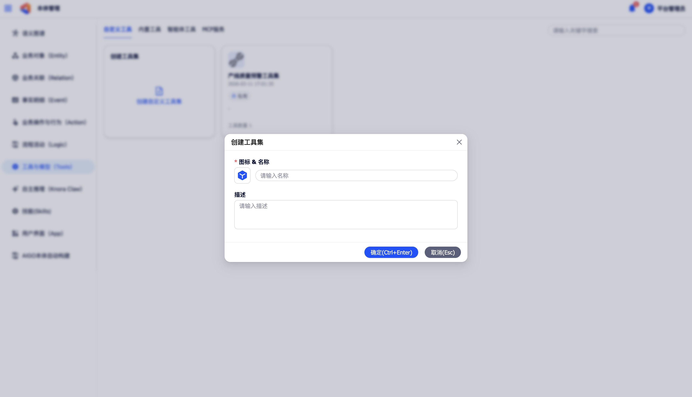
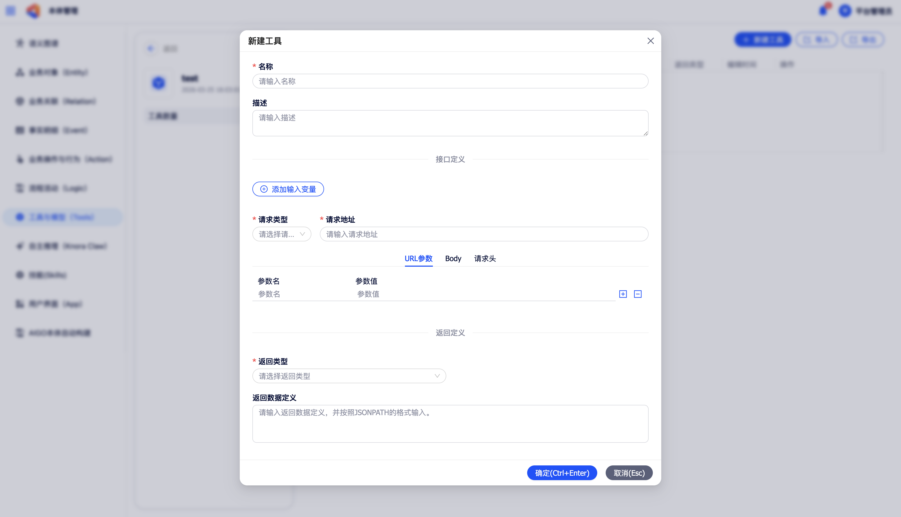

# 工具

工具模块是平台智能体能力的扩展基础，包含**自定义工具**、**内置工具**、**智能体工具**、**MCP 工具**四个子模块，统一管理平台可调用的外部能力。

在左侧导航中点击**工具**，进入工具管理页。

## 自定义工具

自定义工具是将外部系统的 HTTP API 服务注册至平台，并对其输入输出进行包装定义后形成的可调用工具节点，可在 Workflow 的工具调用节点中直接使用。平台以**工具集**为单位对自定义工具进行分类管理。

### 1 新建自定义工具

点击工具集卡片进入工具列表页，点击**新建工具**，在弹窗中完成以下配置：

{ width="100%", loading=lazy }
/// caption
图5-1 新建自定义工具
///

**基本信息**

- **工具名称**（必填）
- **描述**：说明工具的用途，便于在 Workflow 编排中识别（选填）

**工具接口定义**

{ width="100%", loading=lazy }
/// caption
图5-2 新建自定义工具 - 接口定义
///

- **请求类型**：选择 POST 或 GET。
- **请求地址**：填写 API 的完整请求 URL。
- **输入变量**：定义工具在被调用时所需传入的变量，每个输入变量需配置变量名称、中文名、变量类型、是否必填。
- **URL 参数**（选填）：固定请求参数。
- **Body**（选填）：请求体内容。
- **请求头**（选填）：HTTP 请求头配置。

**工具返回定义**

- **返回类型**：选择平台可解析的数据类型（文本、数组、对象等）。
- **返回数据定义**：通过 JSONPath 表达式定义从 API 返回结果中提取的具体字段内容。

### 2 自定义工具查询与维护

工具集列表页支持按**工具集名称**进行检索。

在工具列表中，对每个工具可执行以下操作：

| 操作 | 说明 |
|------|------|
| **查看详情** | 查看工具完整的输入输出参数定义 |
| **编辑** | 修改工具的基本信息与接口配置 |
| **复制** | 创建工具副本并可指定复制至哪个工具集 |
| **批量导入 / 导出** | 选中多个工具批量导出为 .zip 文件，或将 .zip 文件导入 |
| **删除** | 删除当前工具，删除后该工具将从所有引用它的 Workflow 中失效 |

### 3 工具集权限配置

在工具集卡片页面，点击右下角的**权限**按钮，可对该工具集进行权限配置。

## 内置工具

内置工具是平台预集成的功能工具，如联网检索等，无需用户自行开发，开箱即用。

在工具管理页的**内置工具**分页中，可进行以下操作：

- **配置**：为需要鉴权的内置工具填写必要参数，例如为联网检索工具配置所需的 API Key。
- **查看详情**：查看内置工具的详细信息，包括工具说明、输入参数定义及输出参数样例。

## 智能体工具

智能体工具是已通过「发布为工具」操作发布的 Workflow，可在其他 Workflow 的工具调用节点中被直接调用。

在工具管理页的**智能体工具**分页中，可进行以下操作：

- **查看列表**：以列表形式展示所有已发布为工具的智能体。
- **查看详情**：点击**跳转画布**，可直接跳转至该智能体的 Workflow 编排画布。
- **检索**：在搜索框中输入名称关键字，快速定位目标智能体工具。

## MCP 工具

MCP 工具模块统一管理平台内部发布的 MCP 工具与外部接入的 MCP 服务。

在工具管理页的 **MCP 工具**分页中，可进行以下操作：

- **添加外部 MCP 服务**：将外部符合 MCP 协议标准的服务接入平台，配置完成后即可在 Workflow 的工具调用节点中选择调用。
- **管理已接入的 MCP 服务**：查看、编辑或删除已添加的外部 MCP 服务配置。
