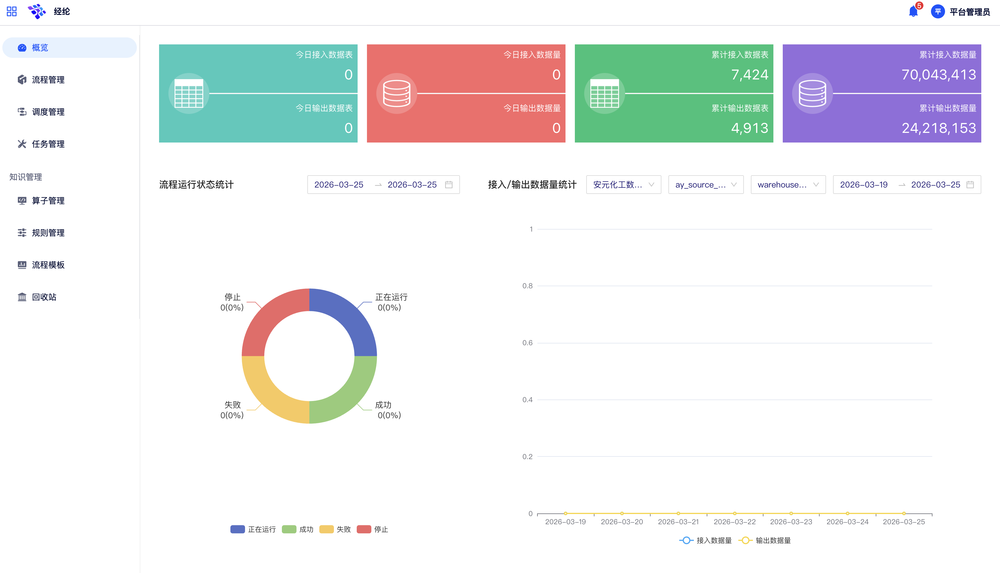

# 经纶（数据治理 Pipeline）

经纶是 {{aio.name}} 平台内置的结构化数据治理 Pipeline 引擎，覆盖数据接入、提取、清洗、标准化、标识与融合等关键环节，支持批式与流式双模式处理。

在左侧导航中点击**经纶**，进入经纶管理页。

## 概览看板

进入经纶模块后，默认展示**概览看板**，提供平台数据治理工作的整体运行视图。

{ width="100%", loading=lazy }
/// caption
图10-1 经纶概览看板
///

概览看板包含以下三类统计信息：

**数据量展示**

- 当天接入的数据表数量与数据量
- 累计接入的数据表数量与数据量

**运行状态统计**

以**饼图**形式展示指定时间区间内不同运行状态的流程数量分布。

**接入 / 输出数据量统计**

以**时序图**形式展示指定时间区间内各维度的数据量随时间的变化趋势。

## 流程管理

### 1 流程分类管理

支持对流程进行分类管理，将不同业务场景或数据域的流程归入对应分类。

### 2 创建流程

支持以下三种方式新建数据治理流程：

- **手动创建**：从空白画布开始，完全自定义流程结构
- **基于模板创建**：从平台内置的流程模板中选择
- **导入创建**：上传已导出的流程配置文件（.zip 或 .json 格式）

### 3 可视化拖拽编排

平台提供以下三类数据组件，共计 **32 个**：

| 组件类型 | 数量 | 说明 |
|------|------|------|
| **数据源** | 6 个 | 作为流程的输入节点 |
| **算子** | 20 个 | 对数据进行转换、清洗、标准化、融合等处理操作 |
| **数据坞** | 6 个 | 将处理后的数据写入目标存储 |

**批流双模式**：可分别构建**批式**和**流式**两种类型的数据治理流程。

**多类型增量数据治理**：对于流式流程，支持**时间增量**、**日期增量**、**自增增量**三种方式获取新增数据。

### 4 流程生命周期管理

对已创建的流程，支持以下操作：

| 操作 | 说明 |
|------|------|
| **智能验证** | 在发布前对流程配置进行自动校验 |
| **编辑** | 修改流程的组件配置与连接结构 |
| **复制** | 创建当前流程的副本 |
| **导出** | 将流程配置导出为文件 |
| **模板化** | 将已构建的流程转换为平台模板 |
| **删除** | 删除流程，已删除流程进入回收站 |

### 5 流程发布与运行控制

- **上线**：将流程正式发布为可运行状态
- **试运行**：以测试模式执行流程，验证流程逻辑
- **运行**：正式触发流程执行

### 6 流程批量操作

- **批量上线 / 下线**：同时切换多个流程的运行状态
- **批量删除**：同时删除多个流程

## 调度管理

### 工作流运行控制

- **查看状态**：实时查看每个工作流的当前运行状态
- **停止**：强制终止正在运行的工作流
- **暂停**：暂停工作流的执行，保留当前进度

### 失败工作流重试恢复

- **重跑**：从头开始重新执行整个工作流
- **恢复失败**：从失败的节点处继续执行

## 任务管理

### 任务全生命周期管理

- **查看 / 详情查看**：查看任务的基本信息与执行状态
- **日志查看**：查看任务的完整运行日志
- **取消 / 停止**：对任务执行进行控制

### 节点数据预览

对于**试运行成功**的流程任务，可在任务详情中对流程中每个节点的输出数据进行预览。

### 任务高级检索

支持对任务列表进行**多条件组合查询**，快速定位特定任务。

## 知识管理

### 算子管理

- **列表查看**：查看全部可用算子及其说明
- **启用 / 禁用**：支持单个与批量启禁用操作

### 规则管理

- **列表查看**：查看全部已定义的治理规则
- **验证**：对规则逻辑进行测试验证
- **启用 / 禁用**：支持单个与批量启禁用操作

### 标签管理

标签用于对数据资产进行语义标注，支持**系统标签**（平台预置）与 **UGC 标签**（用户自定义）两种类型。

### 模板管理

模板管理用于维护流程模板库，支持多条件查询与删除操作。

## 回收站

已删除的流程不会立即永久删除，而是进入**回收站**暂存：

- **恢复还原**：将流程从回收站恢复至流程管理列表
- **彻底删除**：永久删除流程，彻底删除后**不可恢复**
